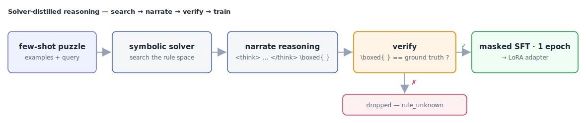

# Nemotron Reasoning LoRA

Fine-tune **Nemotron-3-Nano-30B-A3B** — a 30B hybrid Mamba-2 + Mixture-of-Experts model —
with LoRA, on a single GPU, in one epoch. The run produces a small adapter packaged as
`submission.zip` for the
[NVIDIA Nemotron Model Reasoning Challenge](https://www.kaggle.com/competitions/nvidia-nemotron-model-reasoning-challenge),
where this recipe scores around **0.86** on the private leaderboard.

## Approach

Every task is a **few-shot rule-induction puzzle**: a handful of worked examples demonstrate
a hidden transformation, and the model must infer the rule and apply it to a held-out query.
The method doesn't ask the base model to guess — it **distils an exact, verified solving
procedure** into it.



### 1. Symbolic solvers recover the rule

[`data_pipeline/reasoners/`](data_pipeline/reasoners/) holds one solver per family. Each
searches the space of rules that family allows until it finds one consistent with every
example:

| Family | What the solver searches for |
|--------|------------------------------|
| `cipher` | the substitution map — by matching letter patterns against a word list |
| `cryptarithm` | the digit↔symbol assignment and arithmetic op — concat detection first, then brute force (≤8 symbols) or backtracking, under a per-problem timeout |
| `bit_manipulation` | the per-bit boolean function (AND / OR / XOR / NOT / AND-NOT / …) for each of the 8 output columns |
| `gravity`, `numeral`, `unit_conversion`, `equation_numeric` | the family parameters that reproduce all the examples |

### 2. The solver narrates its reasoning

It doesn't just return the answer — it emits a natural-language chain-of-thought that
mirrors *how* the rule was found, ending in a boxed answer. That trace is the training
target. The prompt (the problem, up to the opening `<think>`) is masked; only the reasoning
and answer are supervised:

```
<think>
 ...the deduction, step by step...
</think>
\boxed{ANSWER}<|im_end|>
```

So the model never memorises answers — it learns to *reproduce the procedure* that derives
them.

### 3. Only verified traces become training data

After generating a trace, the pipeline pulls the `\boxed{}` answer back out and compares it
to ground truth. A problem is marked `rule_found` and added to the corpus **only if they
match** — about **8,400 of ~9,500** problems clear this bar. Underdetermined `_guess`
categories (where no unique rule exists) are kept as well, teaching the model to produce a
plausible attempt rather than stall.

### 4. Training signal

- **Masked SFT** — loss on the reasoning and answer only, never the prompt.
- **Sub-skill augmentation** — extra spelling / matching / splitting / concatenation
  examples that drill the smaller skills the puzzles compose from.
- **One epoch, deliberately** — the corpus is near-deterministic, so a second pass just
  memorises it and the score regresses. One epoch with cosine LR `2e-4 → 2e-5`, dropout
  `0.05` and weight decay `0.01` learns the procedures and stops there.

## Training on one GPU

A 30B hybrid MoE model won't fine-tune on a single card the naive way — the optimizer
states and the full-vocabulary logits alone blow past the memory budget. Four pieces of
engineering bring it back inside one 96 GB GPU.


- **One LoRA for all 128 experts.** A separate adapter per expert would be 128× the
  trainable parameters and unstable over one epoch. The expert LoRA factors are *tied* —
  initialised to their mean, kept in sync by summing gradients — so the bank learns one
  shared low-rank update.
- **Cut Cross-Entropy.** The largest memory spike is the `lm_head` projection over a big
  vocabulary. Fusing that projection with the cross-entropy into one kernel means the full
  logit tensor is never materialised.
- **A hand-attached `lm_head` LoRA.** Unsloth drops it for MoE models, so it's re-added by
  hand and its saved key prefix rewritten to match the runtime model.
- **Split precision + Mamba fast path.** LoRA factors fp32, base weights bf16, MoE router
  fp32; the Mamba CUDA fast path is re-enabled for the state-space layers.

## Build the corpus

[`data_pipeline/`](data_pipeline/) generates the training corpus end to end. The steps
expect the competition `train.csv`, the base-model `tokenizer.json`, and a `problems.jsonl`
rule index in the folder.


```bash
cd data_pipeline
python reasoning.py        # solver traces      -> reasoning/*.txt
python augmentation.py     # augmented examples -> augmentations/*.txt
python corpus.py           # tokenize + mask    -> corpus/<pid>/synthetic.jsonl
python export_tokens.py    #                    -> tokens/ + index.jsonl
```

The output is two artefacts the trainer consumes — a token sequence plus loss mask per
problem, and an index that fixes the training order:

```
tokens/<problem_id>/synthetic.json   # {"tokens": [...], "mask": [...]}   1 = supervised, 0 = prompt
index.jsonl                          # {"problem_id": "...", "epoch": 0}
```

## Get started

The base model is pulled automatically via `kagglehub`. Run it as a package:

```python
from nemotron_lora import train, TrainConfig

train(TrainConfig(corpus_path_override="data_pipeline/tokens",
                  train_order_path_override="data_pipeline/index.jsonl"))
```

or from the shell with `python -m nemotron_lora`, or open
[`notebooks/train.ipynb`](notebooks/train.ipynb) — the same code inline, ready to run on
Kaggle with no repo imports.

> [!NOTE]
> You'll need a single GPU with ~90 GB of VRAM. The reference run used one RTX PRO 6000
> Blackwell (96 GB) and finished in about 4 hours. For a faithful reproduction, pin the
> CUDA kernels to `mamba-ssm==2.3.1` and `causal-conv1d==1.6.1`.

## Project layout

```
src/nemotron_lora/    # the trainer: config, data loading, training loop, adapter export
data_pipeline/        # corpus generation: solvers, augmenters, tokenization
notebooks/train.ipynb # the whole thing inline, Kaggle-ready
tests/                # self-checks for the data loaders
```
