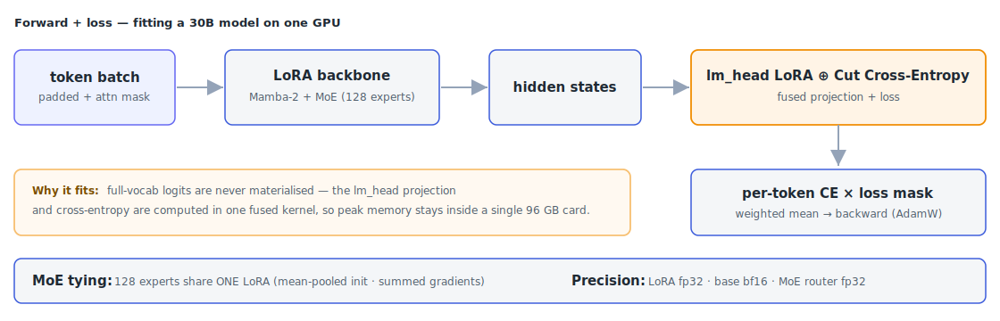
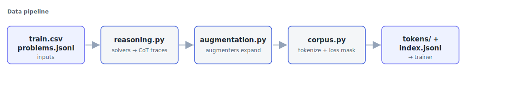

# Nemotron Reasoning LoRA

Fine-tune **Nemotron-3-Nano-30B-A3B** — a 30B hybrid Mamba-2 + Mixture-of-Experts model —
with LoRA, on a single GPU, in one epoch. The run produces a small adapter packaged as
`submission.zip` for the
[NVIDIA Nemotron Model Reasoning Challenge](https://www.kaggle.com/competitions/nvidia-nemotron-model-reasoning-challenge),
where this recipe scores around **0.86** on the private leaderboard.

## How it works

A 30B hybrid MoE model won't fine-tune on a single card the naive way — the optimizer
states and the full-vocabulary logits alone blow past the memory budget. The training loop
leans on four ideas to bring it back inside one GPU.



**One LoRA for all 128 experts.** A separate adapter per expert would be 128× the trainable
parameters and unstable over a single epoch. Instead the expert LoRA factors are *tied*:
initialised to their mean and kept in sync by summing their gradients, so the whole expert
bank learns one shared low-rank update.

**Cut Cross-Entropy.** The biggest memory spike is the `lm_head` projection to a large
vocabulary. Fusing that projection with the cross-entropy into a single kernel means the
full logit tensor is never materialised — peak memory stays well under 96 GB.

**A hand-attached `lm_head` LoRA.** Unsloth drops the `lm_head` adapter for MoE models, so
it's re-added by hand and its saved key prefix is rewritten to match the runtime model. The
Mamba CUDA fast path is re-enabled for the state-space layers, and precision is split by
component — LoRA factors in fp32, base weights in bf16, the MoE router in fp32.

**A gentle schedule.** Cosine LR `2e-4 → 2e-5`, LoRA dropout `0.05`, weight decay `0.01`.
One epoch is enough to learn the corpus without memorising it.

The loss itself is masked: the model is only scored on the reasoning + answer tokens, never
on the prompt.

## The data

Training reads a pre-tokenized corpus — one file per problem with a token sequence and a
loss mask (`1` = supervised, `0` = prompt) — plus an index that fixes the order.



[`data_pipeline/`](data_pipeline/) builds it end to end: deterministic solvers turn each
problem into a chain-of-thought trace, a set of augmenters expand the set, and everything is
tokenized with its loss mask. The steps expect the competition `train.csv`, the base-model
`tokenizer.json`, and a `problems.jsonl` rule index in the folder.

```bash
cd data_pipeline
python reasoning.py        # solver traces      -> reasoning/*.txt
python augmentation.py     # augmented examples -> augmentations/*.txt
python corpus.py           # tokenize + mask    -> corpus/<pid>/synthetic.jsonl
python export_tokens.py    #                    -> tokens/ + index.jsonl
```

The output is two artefacts the trainer consumes:

```
tokens/<problem_id>/synthetic.json   # {"tokens": [...], "mask": [...]}
index.jsonl                          # {"problem_id": "...", "epoch": 0}
```

## Get started

The base model is pulled automatically via `kagglehub`. Run it as a package:

```python
from nemotron_lora import train, TrainConfig

train(TrainConfig(corpus_path_override="data_pipeline/tokens",
                  train_order_path_override="data_pipeline/index.jsonl"))
```

or from the shell with `python -m nemotron_lora`, or open
[`notebooks/train.ipynb`](notebooks/train.ipynb) — the same code inline, ready to run on
Kaggle with no repo imports.

> [!NOTE]
> You'll need a single GPU with ~90 GB of VRAM. The reference run used one RTX PRO 6000
> Blackwell (96 GB) and finished in about 4 hours. For a faithful reproduction, pin the
> CUDA kernels to `mamba-ssm==2.3.1` and `causal-conv1d==1.6.1`.

## Project layout

```
src/nemotron_lora/    # the trainer: config, data loading, training loop, adapter export
data_pipeline/        # corpus generation: solvers, augmenters, tokenization
notebooks/train.ipynb # the whole thing inline, Kaggle-ready
tests/                # self-checks for the data loaders
```
